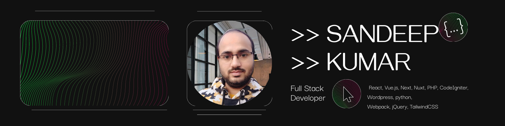

# Hello, folks! 

<h3>Hi! 👋 I'm Sandeep Kumar </h3>
<h5>I build website using various technologies like react, vue, next, nuxt, mongodb, expressjs, javascript, php, wordpress, codeIgniter etc. I have more than 10 years of web developing experience. Do you have a project or need a solution? Then ↴ <a href="mailto:wd.sandeep@gmail.com">Contact me to get in touch now!</a></h5>

 

 

<!-- 

 -->

<!-- Actual text -->

You can find me on <a href="https://twitter.com/wdsandeep" target="_blank">Twitter</a> and <a href="https://www.linkedin.com/in/sandeep-kumar-318bb14a/" target="_blank">Linkedin</a> .

